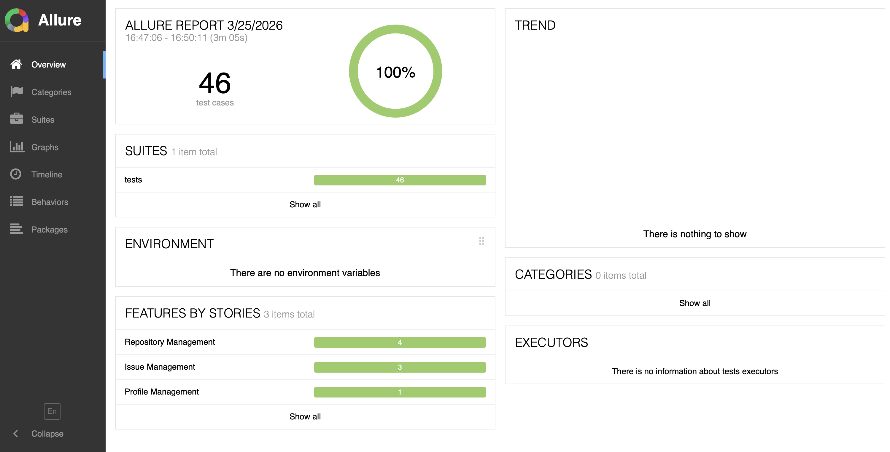
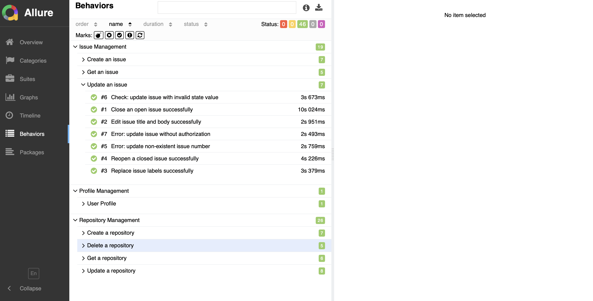

# 🛠️ GitHub REST API Automation Framework


## ✅ Table of Contents
1. [Description](#-description)
2. [Tech Stack & Tools](#-tech-stack-&-tools)
3. [Key Architectural Features](#-key-architectural-features)
4. [Project Structure](#-project-structure)
5. [Test Coverage](#-test-coverage)
6. [Execution Guide](#-execution-guide)
7. [CI/CD Workflow](#-cicd-workflow)

## 💫 Description
This project is a professional automation framework for testing the **GitHub REST API**. It covers the full **CRUD** lifecycle of Repositories and Issues, focusing on security, data integrity and stable asynchronous operations. 
The framework is designed to be scalable, maintainable and resilient to GitHub's eventual consistency.

## 🧑‍💻Tech Stack & Tools
- **Language:** Python 3.11+
- **HTTP Client:** [Requests](https://requests.readthedocs.io)
- **Framework:** [Pytest](https://docs.pytest.org/)
- **Reporting:** [Allure Framework](https://docs.qameta.io)
- **Configuration:** [Python-dotenv](https://pypi.org) (Environment Variables)
- **CI/CD:** GitHub Actions

## 🏗️ Key Architectural Features
Unlike basic script-based tests, this framework implements advanced engineering patterns:

*   **Service Layer Pattern:** API logic is encapsulated in service classes (`RepoService`, `IssueService`), making tests declarative and easy to read.
*   **Base Service Inheritance:** Common logic like authorization headers and base URLs is centralized in a parent class to follow the **DRY** principle.
*   **Automatic Data Cleanup (Teardown):** Uses Pytest fixtures with `yield` and dynamic tracking to ensure all created repositories and issues are deleted after tests, even if they fail.
*   **Security Mindset:** Includes comprehensive checks for unauthorized access (401) and private resource hiding (404).

## 📁 Project Architecture
```text
    ├── .github/workflows/              # CI/CD pipeline configuration 
    ├── allure-results/                 # Raw test execution data (generated after run)
    ├── services/                       # API Clients (Service Layer)
    │   ├── base_service.py             # Parent class with auth & config
    │   ├── repo_service.py             # Repository management logic
    │   ├── issue_service.py            # Issue tracking logic
    │   ├── user_service.py             # User profile operations
    │ 
    ├── srs/                            # Support modules
    │   ├── config.py                   # API Configuration and Base URL
    │ 
    ├── tests/                          # Test scenarios
    │   ├── test_create_issue.py
    │   ├── test_create_repo.py
    │   ├── test_delete_repo.py
    │   ├── test_get_issue.py
    │   ├── test_get_repo.py
    │   ├── test_profile_access.py
    │   ├── test_update_issue.py
    │   ├── test_update_repo.py
    │   
    ├── .env                            # File for secrets
    ├── conftest.py                     # Global fixtures & Cleanup logic
    ├── pytest.ini                      # Configuration file (Allure flags)
    ├── requirements.txt                # Project dependencies
    ├── .gitignore                      # Files to exclude from Git
    └── README.md                       # Comprehensive project documentation
```

## 🧪 Test Coverage
The framework provides comprehensive coverage for the core functional modules of the **GitHub REST API**, ensuring data integrity and secure access.

### 1. Repository Management (CRUD Lifecycle)
*   **Creation Flow (`POST`):**
    *   Successful creation with minimal data (name only) and full metadata.
    *   Validation of default settings (public/private visibility, features).
    *   Error handling for duplicate names (**422 Unprocessable Entity**).
    *   Validation of mandatory fields (missing or empty name).
*   **Repository Access (`GET`):**
    *   Verification of repository details and metadata consistency.
    *   Data type validation (Schema check) for essential fields like `id` and `permissions`.
    *   Security check: verifying that private repositories are hidden (**404**) from unauthorized users.
*   **Update Operations (`PATCH`):**
    *   Successful renaming (handling **409 Conflict** via wait strategies).
    *   Partial updates: changing description, visibility and toggling features (Wiki, Issues).
    *   Validation of "Lenient Parsing": how the API handles invalid data types in updates.
*   **Deletion Flow (`DELETE`):**
    *   Successful removal of existing and renamed repositories (**204 No Content**).
    *   **Ghost Check:** Verifying that a resource returns **404** immediately after deletion.

### 2. Issue Tracking & Workflow
*   **Issue Creation (`POST`):**
    *   Creation with complex metadata: body Markdown, labels and assignees.
    *   **Stateful Validation:** Verifying incremental numbering (1, 2, 3...) within a repository.
    *   Validation of mandatory fields (Title presence check).
*   **Issue Management (`GET` & `PATCH`):**
    *   Data consistency check: verifying `author_association` is correctly set to `OWNER`.
    *   **Workflow Automation:** Closing an open issue and reopening a closed one via state transitions.
    *   **Collection Management:** Replacing old labels with new ones (Verify "Overwrite" logic).

### 3. Security & Resilience
*   **Authentication & Authorization:**
    *   Verifying that all destructive (DELETE) and private (PATCH/GET) methods return **401 Unauthorized** when a token is invalid or missing.
*   **Error Resilience:**
    *   Handling of **Race Conditions** and **Eventual Consistency** using custom wait strategies.
    *   Verification of informative error messages for **404 Not Found** and **422 Validation Failed** scenarios.

## ⚙️ Execution Guide
### 1. Environment Setup
Clone the repository and set up a local virtual environment to ensure dependency isolation:

1. **Clone repository**
> ```bash 
> git clone https://github.com/AlyaSmirnova/Sprint_7
> cd GitHub_API_Project
📦 Repository: [GitHub_API_Project](https://github.com/AlyaSmirnova/GitHub_API_Project)

2. **Create a virtual environment**
> ```bash 
> python -m venv venv

3. **Activate the virtual environment**
> ```bash 
> source venv/bin/activate

4. **Install required dependencies**
> `$ pip install -r requirements.txt`

### 2. Configuration (Environment Variables)
The framework uses `python-dotenv` for secure configuration. Before running the tests, follow these steps:

1. **Create a `.env` file** in the root directory of the project.
2. **Add your GitHub credentials** (Ensure your [Personal Access Token](https://github.com) has `repo` and `delete_repo` scopes):

```text
GITHUB_TOKEN=your_personal_access_token_here
GITHUB_USERNAME=your_github_login_name
```

### 3. Running Tests
The framework is pre-configured via `pytest.ini`. You can execute the full test suite and collect Allure results with a single command:
> ```bash 
> pytest
*Note: This will automatically clear previous results and generate new data in the `allure-results` folder.*

### 4. Generating Allure Report
To transform the raw execution data into a visual, interactive HTML report, use the following command:
> ```bash 
> allure serve allure-results
*This will launch a local web server and open the report in your default browser.*

#### 📊 Report Preview:


*Общий вид отчета (Overview)*


*Детализация тестов (Behaviours)*

## ⚙️ CI/CD Workflow
The project is fully integrated with **GitHub Actions** to ensure continuous code quality and API stability. The pipeline is triggered automatically on every `push` to the **main** branch and on every `pull_request`.

### 🚀 Automation Pipeline Steps:
1.  **Environment Provisioning:** A clean **Ubuntu** runner is initialized in the GitHub cloud infrastructure.
2.  **Dependency Management:** 
    *   Python **3.11** environment is set up.
    *   All required libraries (`Requests`, `Pytest`, `Allure`) are installed from `requirements.txt`.
3.  **Secret Management:** Secure connection of `GITHUB_TOKEN` and `GITHUB_USERNAME` via **GitHub Repository Secrets**, ensuring sensitive data is never exposed in the logs.
4.  **Automated Execution:** The full API test suite is executed against the live **GitHub REST API**.
5.  **Artifact Generation:** Test results are collected, and the **Allure results** are prepared for analysis.
6.  **Status Reporting:** Real-time feedback on build success or failure is provided via GitHub status badges and detailed action logs.

### 🛠️ How to configure Secrets in your fork:
To run this workflow in your own repository:
1. Go to **Settings** > **Secrets and variables** > **Actions**.
2. Create **New repository secret**:
   * `GITHUB_TOKEN`: Your Personal Access Token (PAT).
   * `GITHUB_USERNAME`: Your GitHub login.
